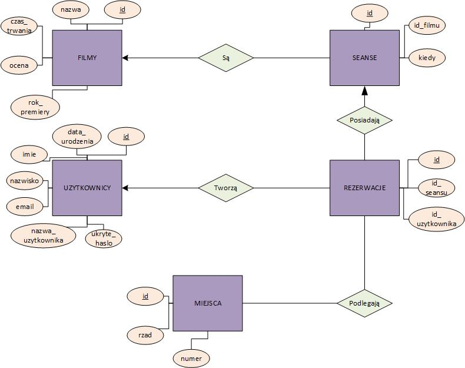
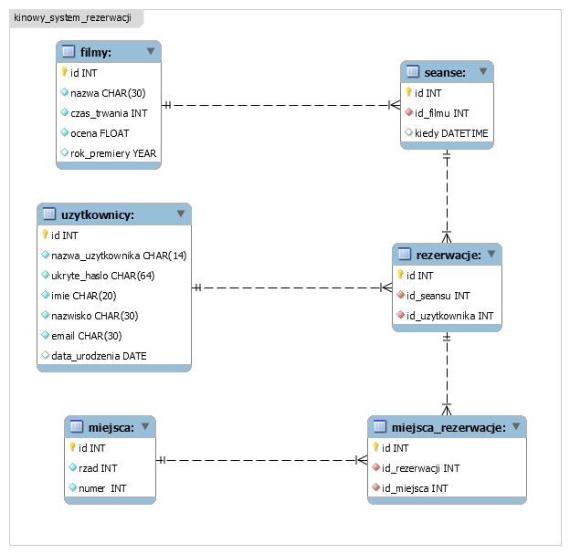

# Kinowy-system-rezerwacji

## Opis

Jest to aplikacja służąca do zarządzania systemem rezerwacji biletów w kinie.

Do jej głównych funkcjonalności należą:
- przeglądanie dostępnych seansów
- rezerwowanie miejsc na wybrane seanse
- przeglądanie dokonanych rezerwacji

System może zostać w przyszłości rozbudowany o następujące funkcjonalności:
- anulowanie dokonanych rezerwacji
- dodawanie filmów i seansów (dla administratorów)
- obsługa wielu sal kinowych
- filtrowanie filmów zgodnie z wiekiem użytkownika

Dostęp do systemu jest zabezpieczony mechanizmem logowania.

## Instrukcja obsługi

### Uruchamianie systemu

Do uruchomienia programu wymagany jest plik `KinowySystemRezerwacji.exe` oraz dostęp do lokalnej bazy danych. Instrukcje inicjalizujące bazę danych są opisane w dalszej części dokumentacji.

### Logowanie i rejestracja

Aby korzystać z systemu, należy mieć w nim zarejestrowane konto. Okno logowania i rejestracji uruchamia się po uruchomieniu pliku startowego. Przycisk na dole ekranu przełącza okno pomiędzy trybem logowania i rejestracji. 

Podczas rejestracji pola są sprawdzane pod kątem spełniania określonych kryteriów:
- Nazwa użytkownika: 8-14 znaków, nie zawiera znaku spacji
- Hasło: co najmniej 8 znaków, co najmniej jedna cyfra, co najmniej jedna wielka litera
- Imię: rozpoczyna się z wielkiej litery, co najwyżej 20 znaków
- Nazwisko: rozpoczyna się z wielkiej litery, co najwyżej 30 znaków
- Email: poprawny zgodnie z ogólnym standardem

W przypadku niespełnienia któregoś  z warunków, odpowiedni komunikat jest wyświetlany na ekranie.

### Korzystanie z systemu

Dane dotyczące zalogowanego użytkownika wyświetlane są na górze ekranu. Na początku wita nas widok istniejących rezerwacji na danego
użytkownika. Następnie w górnym menu można wybrać zakładkę `Repertuar`, w której wybierzemy datę, która nas interesuje odnośnie projekcji filmów. Po podjętej decyzji, mamy do dyspozycji listę seansów w danym dniu. Po podwójnym kliknięciu w wybrany wiersz, pokaże nam się okno z rezerwacją miejsc. 
//TODO
Jak to wygląda potem?

Kolejna zakładka umożliwia nam wylogowanie się, `Wyloguj się: nazwa_uzytkownika`. Powrócimy wtedy do ekranu logowania się do wybranego konta.

## Baza danych

### Tworzenie

Aby utworzyć bazę danych, należy wykonać skrypt zawarty w pliku `create-database.sql`. Natomiast skrypt `create-example-data.sql` wprowadza do przykładowe dane do utworzonej bazy. Nazwa bazy danych: `kinowy_system_rezerwacji`.

### Konfiguracja

Domyślnie skonfigurowaną bazą danych w systemie jest baza lokalna, która powinna znajdować się na lokalnym serwerze na komputerze. Jej dane dostępowe, znajdujące się w pliku źródłowym `DBInfo.resx`, to:
- DataBase: `kinowy_system_rezerwacji`
- Password: puste
- Port: `3306`
- Server: `localhost`
- User: `root`

W przypadku innej lokalizacji bazy danych, należy zaktualizować dane znajdujące się w tym pliku oraz zbudować aplikację. //TODO

### Opis

Baza danych jest przedstawiona schematami znajdującymi się w katalogu `/resources`: //TODO. 

## Dokumentacja kodu

W trakcie procesu tworzenia systemu, utworzony kod był na bieżąco dokumentowany standardowymi komentarzami XML. Każde klasa, metoda, właściwość i zdarzenie o zasięgu większym niż `private` jest udokumentowane (z wyjątkiem metod implementujących interfejs - dokumentacja znajduje się wtedy w klasie interfejsu). Dodatkowo udokumentowane są również niektóre metody oraz pola prywatne. 

Aby wygenerować plik dokumentacji, należy coś tam wykonać. //TODO

## Podział pracy

Autorzy systemu: Bartłomiej Szlachta, Kamil Rusin.

Praca została podzielona na jak najmniejsze, niezależne zadania, opisane w zakładce `Issues`. Dla każdego zadania zapisana jest informacja o osobie wykonującej zadanie oraz dodatkowe informacje pomocnicze.

Każde zadanie wykonywane jest na osobnej gałęzi, której nazwa jest zgodna ze schematem: `feature-{numer zagadnienia}`. Po ukończeniu zadania:
- Osoba rozwiązująca zadanie tworzy odpowiedni Pull Request o nazwie identycznej z nazwą zadania
- Osobę niebędącą autorem rozwiązania zadania recenzuje Pull Request 
- Osoba rozwiązująca zadanie wprowadza ewentualne poprawki
- Gałąź jest scalana do głównej gałęzi, operacja jest zapisywana jako jedna modyfikacja (poszczególne Commity są scalane)
